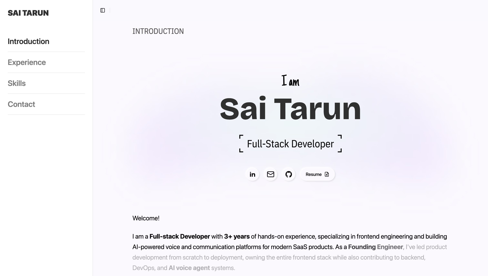

# Sai Tarun's Portfolio

This is my portfolio website. It is built with Astro and Tailwind CSS.

It is deployed on GitHub Pages. [Check it out here](https://saitaruna.github.io/portfolio).

## 🧞 Commands

All commands are run from the root of the project, from a terminal:

| Command                   | Action                                           |
| :------------------------ | :----------------------------------------------- |
| `npm install`             | Installs dependencies                            |
| `npm run dev`             | Starts local dev server at `localhost:4321`      |
| `npm run build`           | Build your production site to `./dist/`          |
| `npm run preview`         | Preview your build locally, before deploying     |
| `npm run astro ...`       | Run CLI commands like `astro add`, `astro check` |
| `npm run astro -- --help` | Get help using the Astro CLI                     |

Designed & Developed by [Sai Tarun](https://github.com/SaiTarunA)
